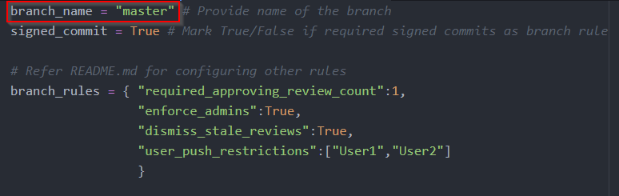
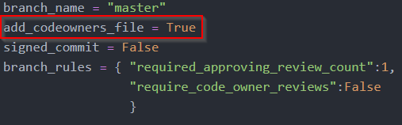
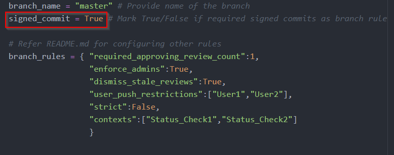
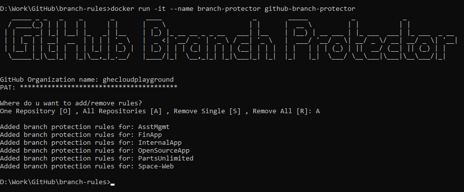

# GitHub Branch Protector

**This tool will bulk add, remove or modify branch protection rules for every repo or a single repo in any GitHub organization.**

The tool can:
- Add or Update branch rules for a single repository.
- Add or Update branch rules for all repositories in the organization.
- Remove branch rules for a single repository.
- Remove branch rules for all repositories in the organization.

## Prerequisites

- A GitHub organization with permissions to update branch protection rules.<br>
  
  *Note: The tool is not developed for personal accounts in GitHub*

- Docker installed in your machine. To download and install docker for Mac, Linux or windows [click here.](https://docs.docker.com/get-docker/)

## How to configure

1. If need to set branch protection rules for teams or users, verify the roles and access of corresponding teams in the repositories.
   
   *Note: If proper role not set the tool just skips the branch rule and add other branch rules specified.*

2. Clone this repository to your machine.

3. Open **config.py** in any text editor.

4. Replace **master** with the branch name required. Verify whether the branch exists in the repositories.

   

5. Skip the remaining part of this section if you are only planning to **Remove** the branch protection rule.

6. Provide value for **add_codeowners_file** as **True** if you need to add or update **CODEOWNERS** file which is required for branch rule **Require review from Code Owners** else keep it as **False**
   
   *Note: Also configure the **CODEOWNERS** file in this repo for this to be done. To learn how the configure **CODEOWNERS** [click here](https://docs.github.com/en/free-pro-team@latest/github/creating-cloning-and-archiving-repositories/about-code-owners)*
   
   
   
7. Provide value for **signed_commit** as **True** if you need branch rule **Require signed commits** else keep it as **False**.

   

8. Add the branch protection rules which are required to add or modify in the repositories in **branch_rules** section with the following syntax.
   ```
   branch_rules = { "key":int_value,
                    "key2":["string_value1","string_value2","string_value3"],
                    "key3":boolean_value # True/False
                    }
    ```

9. Refer the following table to configure.

   | Key | Value Type | Branch Rule | Example |
   |-----|------------|-------------|---------|
   | strict | boolean | Require branches to be up to date before merging. Should come along with contexts. | branch_rules = { "strict":True,  "contexts": ["BUILD_VALIDATE_JOB"] } |
   | contexts | string list | Enable status checks. Should come along with strict. | branch_rules= { "strict":True, "contexts": ["BUILD_VALIDATE_JOB","CODE_SCAN_JOB"] } |
   | enforce_admins | boolean | Include administrators | branch_rules = { "enforce_admins":True } |
   | required_approving_review_count | int | Require pull request reviews before merging with approver count as value provided | branch_rules = { "required_approving_review_count":2 }
   | dismissal_users | string list | Restrict users who can dismiss pull request reviews. | branch_rules = { "required_approving_review_count":2, "dismissal_users":["User1","User2","User3"] } |
   | dismissal_teams | string list | Restrict teams who can dismiss pull request reviews. |  branch_rules = { "required_approving_review_count":2, "dismissal_teams":["Internal_App_Team","OSS_Devs"] } |
   | dismiss_stale_reviews | boolean | Dismiss stale pull request approvals when new commits are pushed | branch_rules = { "required_approving_review_count":1, "dismiss_stale_reviews": True } |
   | require_code_owner_reviews | boolean | Require review from Code Owners | branch_rules = { "required_approving_review_count":1, "require_code_owner_reviews": True } |
   | user_push_restrictions | string list | Restrict users who can push to matching branches | branch_rules = { "user_push_restrictions":["User1","User2","User3"] } |
   | team_push_restrictions | sting list | Restrict teams who can push to matching branches | branch_rules = { "team_push_restrictions":["Internal_App_Team","OSS_Devs"] } |

10. Save and close **config.py**.

## How to execute

1. Open cmd/terminal and navigate to the path where the tool is cloned.

    ```cd <path-to-the-repository>```

2. Run the following command to build the tool.

    ```docker build -t github-branch-protector .```

3. Run the following command to start the tool.

    ```docker run -it --name branch-protector github-branch-protector```

4. Enter the **organization name**, **PAT** and **Execution type** when prompted. If choosing single repository add/remove you will also have to provide **Repository Name**.

    

5. Verify in GitHub whether the rules are added.

## Remove container and image

1. After successful run you can remove the container and image. Even if you want to re-run you will have to remove it or use another image name and container name in docker commands.

2. Execute the following command to remove the container.

   ```docker container rm branch-protector```

3. Execute the following command to remove the image.

   ```docker rmi github-branch-protector```
